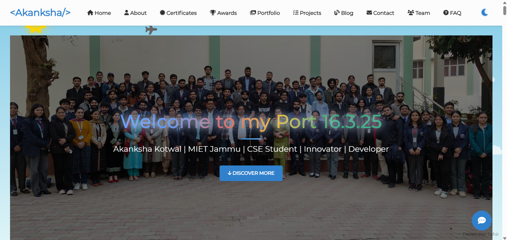
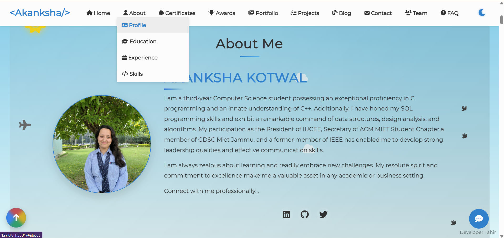
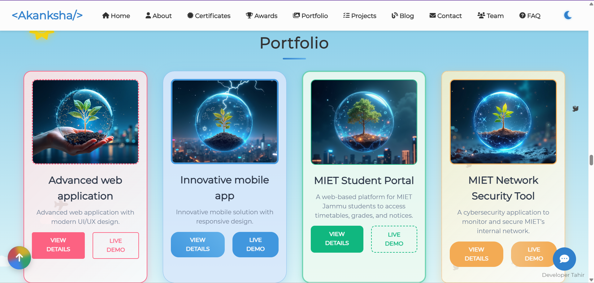
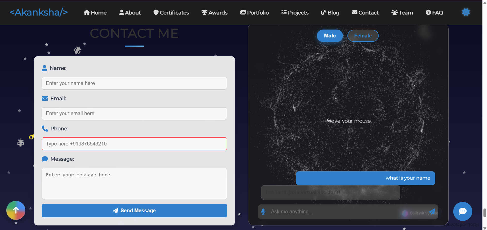
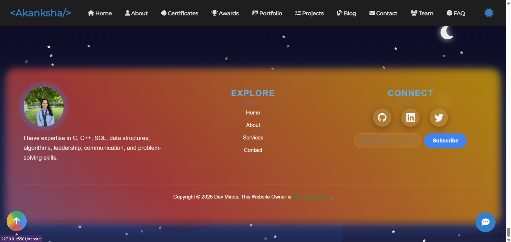
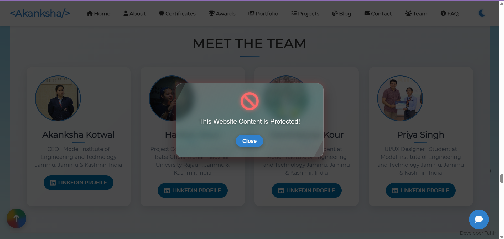

# Akanksha Kotwal - Professional Portfolio



Welcome to my personal portfolio website! This project showcases my skills, education, experience, projects, certificates, awards, and more as a third-year Computer Science and Engineering (CSE) student at MIET Jammu. Built with modern web technologies, this portfolio reflects my journey as a developer, innovator, and leader.


## 📌 Overview
This is a highly advanced and fully responsive website designed with modern UI/UX, animations, and detailed CSS & JavaScript features. It includes multiple sections such as Portfolio, About, Contact, Footer, and Protected Content.

## 🚀 Features
- 🌟 **Fully Responsive Design**
- 🎨 **Advanced CSS & JavaScript Animations**
- 🧩 **Interactive UI/UX Elements**
- 📜 **Detailed Sections** (Portfolio, Contact, About, Footer, etc.)
- 📌 **Protected Content**
- ⚡ **Optimized for Performance & Speed**

## 📂 Sections Preview
- **About Page** 
- **Portfolio Section** 
- **Contact & VA Section** 
- **Footer Section** 
- **Protected Content** 


## Table of Contents
- [Overview](#overview)
- [Features](#features)
- [Technologies Used](#technologies-used)
- [Project Structure](#project-structure)
- [Setup Instructions](#setup-instructions)
- [Usage](#usage)
- [Sections](#sections)
- [Contributing](#contributing)
- [Contact](#contact)
- [License](#license)

## Overview
This portfolio serves as a digital resume and a platform to display my academic and professional achievements. It includes interactive elements, a responsive design, and a variety of sections highlighting my skills, projects, and leadership roles. The website is designed to be visually appealing and user-friendly, with features like dark mode, animations, and a chatbot assistant.

## Features
- **Responsive Design**: Optimized for desktops, tablets, and mobile devices.
- **Navigation**: Includes a sticky navbar, mobile sidebar, and dropdown menus.
- **Interactive Elements**: Progress bars for skills, modals for detailed views, and an accordion FAQ section.
- **Dark Mode**: Toggleable dark/light theme for better user experience.
- **Chatbot**: A basic assistant to answer common queries.
- **Animations**: Preloader, glowing text effects, and background particle animations.
- **Contact Form**: A functional form with validation for user inquiries.
- **Social Integration**: Links to LinkedIn, GitHub, and Twitter profiles.

## Technologies Used
- **HTML5**: Structure and content of the website.
- **CSS3**: Styling, animations, and responsive layouts (includes custom styles in `styles.css`).
- **Font Awesome**: Icons for navigation and decoration.
- **JavaScript**: Interactivity and dynamic content (in `script.js`).
- **External Libraries**:
  - Font Awesome CDN for icons.
  - Spline Design iframe for 3D particle animation in the contact section.
- **Assets**: Images for profile, certificates, awards, and projects stored in the `assets/` folder.

## Project Structure
```
portfolio/
├── index.html         # Main HTML file
├── css/
│   └── styles.css     # Custom CSS styles
├── js/
│   └── script.js      # JavaScript for interactivity
├── assets/            # Images and media files
│   ├── Anku.jpeg
│   ├── certaku.jpeg
│   ├── proj1.jpeg
│   └── ...            # Other assets
└── README.md          # This file
```

## Setup Instructions
1. **Clone the Repository**:
   ```bash
   git clone https://github.com/your-username/portfolio.git
   ```
2. **Navigate to the Project Directory**:
   ```bash
   cd portfolio
   ```
3. **Open the Website**:
   - Open `index.html` in a web browser (e.g., Chrome, Firefox) directly, or
   - Use a local server (recommended for full functionality):
     ```bash
     npx live-server
     ```

4. **Dependencies**: No additional installations are required as all external resources (e.g., Font Awesome) are loaded via CDNs.

## Usage
- Navigate through the sections using the navbar or sidebar (mobile view).
- Toggle dark mode with the moon icon in the header.
- Interact with the chatbot by clicking the chat icon in the bottom-right corner.
- Submit inquiries via the contact form in the "Contact" section.
- Explore projects, certificates, and awards by clicking on items for more details.

## Sections
- **Home**: Introduction with a glowing title and call-to-action button.
- **About**: Personal bio, profile image, and social links.
- **Education**: Academic timeline from 8th grade to B.Tech (CSE).
- **Experience**: Leadership roles, internships, and freelance work.
- **Skills**: Animated progress bars showcasing technical and soft skills.
- **Certificates**: Grid of certifications with links to view details.
- **Awards**: Achievements from MIET Jammu and other events.
- **Portfolio**: Selected projects with images and descriptions.
- **Projects**: Filterable grid of web, cybersecurity, and AI/ML projects.
- **Team**: Collaborators with LinkedIn profiles.
- **FAQ**: Accordion-style frequently asked questions.
- **Blog**: Articles on tech and personal experiences.
- **Contact**: Form and interactive assistant with 3D animation.
- **Footer**: Social links, newsletter subscription, and copyright info.

## Contributing
Contributions are welcome! If you'd like to enhance this portfolio:
1. Fork the repository.
2. Create a new branch (`git checkout -b feature-branch`).
3. Make your changes and commit (`git commit -m "Add feature"`).
4. Push to the branch (`git push origin feature-branch`).
5. Open a pull request.

Please ensure your code follows the existing style and structure.

## 🔧 Installation
```bash
git clone https://github.com/Akanksha880/Portfolio.git
cd your-repository
```

Open `index.html` in your browser or use Live Server.

## 🎯 Usage
- Customize the content in **HTML/CSS/JS** files.
- Modify styles in `styles.css`.
- Adjust functionality in `script.js`.

## Contact
- **Name**: Akanksha Kotwal
- **Email**: [Insert your email here]
- **LinkedIn**: [linkedin.com/in/akanksha-kotwal-b3b008256](https://www.linkedin.com/in/akanksha-kotwal-b3b008256)
- **GitHub**: [Insert your GitHub profile here]
- **Twitter**: [Insert your Twitter handle here]

Feel free to reach out via the contact form on the website or directly through LinkedIn!

## License
This project is licensed under the MIT License. See the [LICENSE](LICENSE) file for details.

---

```
✨ **Developed by Tahir Naseer** ✨
```

*Created by Akanksha Kotwal | Last Updated: March 18, 2025*
---
